# Cairn Conceptual Data Model

A cloud-agnostic view of the Cairn backend. The model spans three store types, and each entity below is tagged with its store.

- **Relational store:** identity, association, and structured case facts
- **Document (non-relational) store:** operational context the AI reads
- **Object store:** uploaded files

```mermaid
erDiagram
    USER ||--o{ CASE_MEMBER : "holds"
    CASE ||--o{ CASE_MEMBER : "shared with"
    CASE ||--|| DECEASED : "is about"
    DECEASED ||--|| DEATH_EVENT : "has"
    DECEASED ||--o| VETERAN_INFO : "may have"
    DECEASED ||--o| ESTATE_INFO : "may have"
    CASE ||--o{ DOCUMENT : "contains"
    USER ||--o{ DOCUMENT : "uploads"
    DOCUMENT ||--|| VAULT_OBJECT : "stored as"
    DOCUMENT |o--o| VETERAN_INFO : "evidences service"
    DOCUMENT |o--o| ESTATE_INFO : "evidences will or letters"
    USER ||--o{ CONSENT : "grants"
    CASE ||--o{ CONSENT : "scoped to"
    USER ||--o{ AUDIT_EVENT : "performs"
    CASE ||--o{ AUDIT_EVENT : "recorded against"
    CASE ||--o{ CONTEXT_ITEM : "described by"

    USER {
        uuid id PK "relational"
        string idp_subject UK "link to identity provider"
        string email
        string display_name
        timestamp created_at
    }

    CASE {
        uuid id PK "relational, security boundary"
        string status
        uuid created_by FK
        timestamp created_at
        timestamp closed_at
        timestamp purge_after
    }

    CASE_MEMBER {
        uuid case_id PK, FK "relational"
        uuid user_id PK, FK
        string relationship
        string role "owner, co_executor, fiduciary, attorney, power_of_attorney, viewer"
        string status "invited, active, revoked"
        timestamp verified_at
        string verification_method
        uuid invited_by FK
    }

    DECEASED {
        uuid id PK "relational"
        uuid case_id FK, UK
        string legal_first_name
        string legal_middle_name
        string legal_last_name
        date date_of_birth
        string ssn_ciphertext "app-layer encrypted"
        string ssn_last4
        string sex
        string domicile_state
        string marital_status
    }

    DEATH_EVENT {
        uuid deceased_id PK, FK "relational"
        date date_of_death
        string place_type "hospital, hospice, home, facility, other"
        string facility_name
        string address_line
        string city
        string county
        string death_state "drives vital records office"
        string country
    }

    VETERAN_INFO {
        uuid deceased_id PK, FK "relational"
        string status "yes, no, unknown"
        string branch
        string va_file_number_ciphertext "app-layer encrypted"
        uuid dd214_document_id FK
    }

    ESTATE_INFO {
        uuid deceased_id PK, FK "relational"
        string has_will "yes, no, unknown"
        string will_location_note
        string has_trust "yes, no, unknown"
        string probate_status
        string probate_court
        string probate_case_number
        string attorney_contact
        uuid will_document_id FK
        uuid letters_document_id FK
    }

    DOCUMENT {
        uuid id PK "relational metadata"
        uuid case_id FK
        uuid uploaded_by FK
        string doc_type
        string original_filename
        string mime_type
        int size_bytes
        string sha256
        string scan_status
        timestamp deleted_at
    }

    VAULT_OBJECT {
        string object_key PK "object store"
        uuid case_id "part of key path"
        blob encrypted_content
        string version_id
    }

    CONSENT {
        uuid id PK "relational"
        uuid user_id FK
        uuid case_id FK
        string purpose
        string policy_version
        timestamp granted_at
        timestamp withdrawn_at
    }

    AUDIT_EVENT {
        uuid id PK "relational, append-only"
        uuid actor_id FK
        uuid case_id FK
        string action
        string object_type
        uuid object_id
        string ip_address
        timestamp occurred_at
    }

    CONTEXT_ITEM {
        uuid case_id PK, FK "document store, no direct identifiers"
        string item_key PK "STATE, CERT, FUNERAL, NOTIFY, ASSET, CONVO"
        json payload
        timestamp updated_at
        timestamp expires_at
    }
```

## Reading the diagram

- **CASE is the security boundary.** Every other entity reaches a person only through a case.
- **CASE_MEMBER is the key association.** It links each authenticated user to the deceased through the case, carrying role, relationship, and verification.
- **CONTEXT_ITEM holds no identity data.** It references the case by ID only, so the AI's read path never needs names, SSNs, or account numbers.
- **DOCUMENT and VAULT_OBJECT are split on purpose.** Searchable metadata lives in the relational store while the encrypted file lives in the object store.

## Sources

- CDC NCHS, US Standard Certificate of Death (basis for place-of-death categories): https://www.cdc.gov/nchs/nvss/revisions-of-the-us-standard-certificates-and-reports.htm
- VA, getting military service records such as the DD-214: https://www.va.gov/records/get-military-service-records/
- NIST SP 800-53 Rev. 5 (access control and audit control families): https://csrc.nist.gov/pubs/sp/800/53/r5/upd1/final
