# Cairn MVP Data Model

Scope: sign up, create a case, collect information about the user and the deceased, and generate a personalized four-week journey of first steps (death certificates, banks, funeral arrangements, and related tasks). No document upload at MVP.

This is a cloud-agnostic conceptual model. It is a reduced version of the full conceptual model in this folder.

Last revised 2026-09-21 to adopt the content-as-code approach for journey templates (see the decision log below).

```mermaid
erDiagram
    USER ||--o{ CASE_MEMBER : "holds"
    CASE ||--o{ CASE_MEMBER : "has"
    CASE ||--|| DECEASED : "is about"
    DECEASED ||--|| DEATH_EVENT : "has"
    CASE ||--o{ CASE_TASK : "journey"
    CONTENT_FILE ||--o{ TASK_TEMPLATE : "loaded at deploy as"
    TASK_TEMPLATE ||--o{ CASE_TASK : "instantiated as"
    TASK_TEMPLATE ||--o{ TEMPLATE_CITATION : "supported by"
    USER ||--o{ CONSENT : "grants"
    USER ||--o{ AUDIT_EVENT : "performs"
    CASE ||--o{ AUDIT_EVENT : "recorded against"
    CASE ||--o{ CONTEXT_ITEM : "described by"

    USER {
        uuid id PK "relational"
        string idp_subject UK "link to identity provider"
        string email
        string first_name
        string last_name
        string phone "optional"
        timestamp created_at
    }

    CASE {
        uuid id PK "relational, security boundary"
        string status "active, paused, closed"
        date journey_started_on
        timestamp tasks_paused_until "supports stepping back from tasks"
        uuid created_by FK
        timestamp created_at
        timestamp purge_after
    }

    CASE_MEMBER {
        uuid case_id PK, FK "relational"
        uuid user_id PK, FK
        string relationship "spouse, child, sibling, other family, POA, fiduciary"
        string role "owner only at MVP"
        string status "active, revoked"
        timestamp created_at
    }

    DECEASED {
        uuid id PK "relational"
        uuid case_id FK, UK
        string legal_first_name
        string legal_middle_name
        string legal_last_name
        date date_of_birth
        string ssn_last4 "full SSN not collected at MVP"
        string domicile_state "drives probate content"
        string veteran_status "yes, no, unknown"
        string has_will "yes, no, unknown"
    }

    DEATH_EVENT {
        uuid deceased_id PK, FK "relational"
        date date_of_death
        string place_type "hospital, hospice, home, facility, other"
        string facility_name
        string city
        string county
        string death_state "drives vital records office"
    }

    CONTENT_FILE {
        string path PK "content repository, authoritative source"
        string task_key
        int version
        string content_hash
        string git_release "tag or commit"
    }

    TASK_TEMPLATE {
        uuid id PK "relational, read-only, immutable per version"
        string task_key UK "unique with version"
        int version UK
        string title
        string plain_summary
        int journey_week "1 to 4"
        int sort_order
        int due_offset_days "from journey start"
        string jurisdiction "US or state code"
        json applies_when "JSONB rules on veteran, will, state"
        boolean attorney_referral
        timestamp counsel_reviewed_at
        string content_hash
        string git_release
        boolean active
        timestamp loaded_at
    }

    TEMPLATE_CITATION {
        uuid id PK "relational, read-only, loaded with template"
        uuid template_id FK
        string authority_name "issuing authority"
        string url
        string jurisdiction
        date last_verified_on
    }

    CASE_TASK {
        uuid id PK "relational"
        uuid case_id FK
        uuid template_id FK "pinned to an immutable template version"
        string status "not_started, in_progress, done, skipped, not_applicable"
        date due_on
        timestamp snoozed_until
        timestamp completed_at
        timestamp updated_at
    }

    CONSENT {
        uuid id PK "relational"
        uuid user_id FK
        string purpose "terms, privacy, ai_processing"
        string policy_version
        timestamp granted_at
        timestamp withdrawn_at
    }

    AUDIT_EVENT {
        uuid id PK "relational, append-only"
        uuid actor_id FK
        uuid case_id FK
        string action
        string object_type
        uuid object_id
        timestamp occurred_at
    }

    CONTEXT_ITEM {
        uuid case_id PK, FK "document store, no direct identifiers"
        string item_key PK "CERT_ORDER, FUNERAL, BANK_NOTICES, CONVO_SUMMARY"
        json payload
        timestamp updated_at
        timestamp expires_at
    }
```



## Decision log

| # | Decision | Status |
|---|---|---|
| 1 | Journey data stays in the relational database. `applies_when` rules are stored as JSON in a JSONB column, which gives flexible rules without a second database. | Adopted for MVP |
| 2 | Journey templates and citations are authored as versioned files in a repository (content-as-code). A deploy job loads them into read-only `TASK_TEMPLATE` and `TEMPLATE_CITATION` tables. | Adopted for MVP |
| 3 | A derived, read-optimized journey snapshot in the document store for AI context assembly. | Deferred, see triggers below |

### How items 1 and 2 fit together

The repository is the authoritative source for wording, rules, and citations, so every change gets a pull request and a review trail. The database tables are a read-only copy loaded at deploy. Each template version becomes an immutable row, and `CASE_TASK` points at that exact row. This keeps foreign keys, JSONB rules, and cross-case queries, and it preserves a permanent record of what each family was shown.

Database rows for templates are never edited by hand. A correction means a new file version, a new release, and a new row.

### Item 3: deferred

Add a `JOURNEY_SNAPSHOT` item to `CONTEXT_ITEM` (current week and next few tasks, projected from `CASE_TASK`) only if one of these becomes true:
- AI context assembly becomes a measurable share of latency or cost.
- Task reads dominate overall load.
- Templates diverge into very different structures by state.

The relational tables stay the source of truth if this is added. The snapshot is a disposable copy.

## How the journey works

1. Authors edit template files in the content repository. A pull request runs validation (see rules below).
2. Counsel review is recorded in `counsel_reviewed_at` before a release is tagged.
3. The deploy job loads the tagged release, inserting new immutable `TASK_TEMPLATE` and `TEMPLATE_CITATION` rows for any changed file.
4. On case creation, the system reads the deceased's `death_state`, `domicile_state`, `veteran_status`, and `has_will`, matches `applies_when` and `jurisdiction`, and creates one `CASE_TASK` per match with a `due_on` date.
5. The AI reads `CASE_TASK` status and `CONTEXT_ITEM` details to answer "where are we" and to choose the next single action.

### Release gate rules (validated in CI)

- Every template file must validate against a JSON Schema ([json-schema.org](https://json-schema.org/)).
- Every template must have at least one citation with an authority name, URL, and `last_verified_on`.
- Any template with a jurisdiction other than `US` must name a state code.
- Any template marked `attorney_referral` must include referral wording.
- A release cannot be tagged while any changed template has an empty `counsel_reviewed_at`.
- `task_key` plus `version` must be unique, and a changed file must bump `version`.

### Example template file (illustrative draft, not reviewed)

```json
{
  "task_key": "notify_social_security",
  "version": 1,
  "title": "Let Social Security know",
  "plain_summary": "Ask the funeral home whether they will report the death for you, then confirm it was done.",
  "journey_week": 2,
  "sort_order": 10,
  "due_offset_days": 10,
  "jurisdiction": "US",
  "applies_when": { "always": true },
  "attorney_referral": false,
  "counsel_reviewed_at": null,
  "citations": [
    {
      "authority_name": "Social Security Administration",
      "url": "https://www.ssa.gov/benefits/survivors/",
      "jurisdiction": "US",
      "last_verified_on": null
    }
  ]
}
```

Suggested layout: `content/tasks/us/` for federal tasks and `content/tasks/<state code>/` for state-specific tasks.

### Finding affected families after a correction

When counsel corrects a template, a query over the immutable versions finds every case still working from the old wording:

```sql
SELECT ct.case_id, ct.id
FROM case_task ct
JOIN task_template t ON t.id = ct.template_id
WHERE t.task_key = 'notify_social_security'
  AND t.version < 2
  AND ct.status IN ('not_started', 'in_progress')
```

## Illustrative tasks by week (to reconcile with the journey map)

| Week | Example task keys |
|---|---|
| 1 | confirm_pronouncement, secure_home_and_pets, choose_funeral_provider, order_death_certificates |
| 2 | notify_social_security, notify_employer_and_pension, notify_banks |
| 3 | notify_life_insurers, notify_va_if_veteran, notify_credit_bureaus |
| 4 | forward_mail, cancel_subscriptions, locate_will_and_attorney, plan_next_steps |

## What lives in CONTEXT_ITEM payloads

| item_key | Example payload fields |
|---|---|
| CERT_ORDER | copies_requested, ordered_on, issuing_office, expected_by |
| FUNERAL | provider_name, venue, service_date, service_time, booking_status |
| BANK_NOTICES | list of institution names with notified date and status |
| CONVO_SUMMARY | redacted running summary for continuity |

## Deferred from the full model

- `VETERAN_INFO` and `ESTATE_INFO` become full tables later. At MVP they are single flag columns on `DECEASED`.
- `DOCUMENT` and `VAULT_OBJECT` are removed. No file uploads at MVP, which shrinks the security surface.
- Multi-member sharing is deferred. `CASE_MEMBER` is kept so invites need no schema change later.
- Full SSN and VA file number storage are deferred.
- `JOURNEY_SNAPSHOT` in the document store (decision 3).

## Design notes

- `tasks_paused_until` lets the product step back from task mode without storing any inference about the user's emotional state.
- Do not persist distress classifications at MVP. Health and mental health details are sensitive under the project's privacy policy draft.
- `TEMPLATE_CITATION` and `counsel_reviewed_at` enforce the rule that jurisdiction-specific guidance needs a citation to the issuing authority and legal review.

## Sources

- PostgreSQL, JSON types (JSONB): https://www.postgresql.org/docs/current/datatype-json.html
- JSON Schema: https://json-schema.org/
- CDC NCHS, Where to Write for Vital Records (death_state determines the issuing office): https://www.cdc.gov/nchs/w2w/index.htm
- SSA, survivors benefits and reporting a death: https://www.ssa.gov/benefits/survivors/
- FTC, Funeral Rule (consumer price list rights): https://www.ftc.gov/legal-library/browse/rules/funeral-rule
- NIST SP 800-53 Rev. 5 (audit and access control families): https://csrc.nist.gov/pubs/sp/800/53/r5/upd1/final
